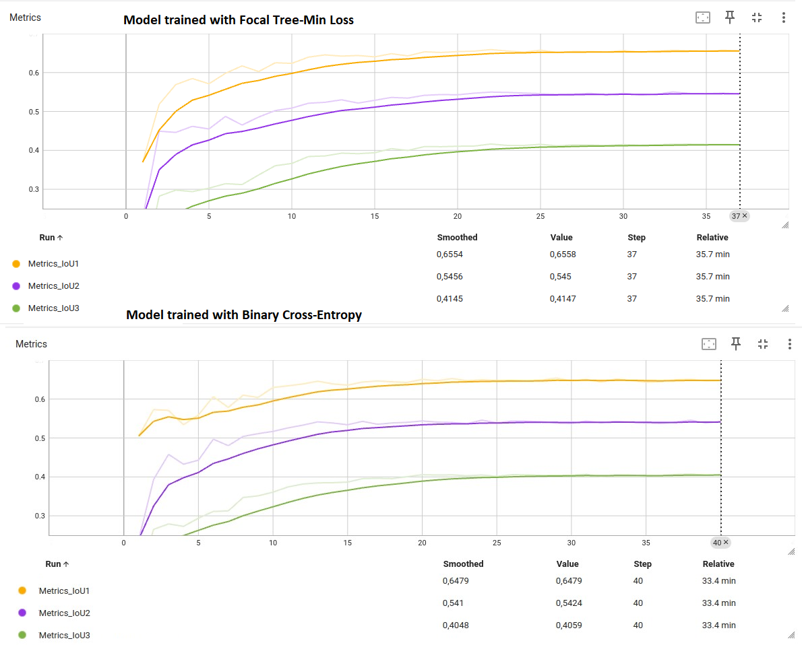
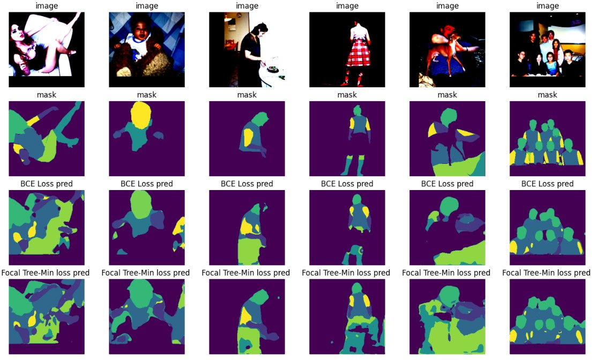

# Hierarchical Semantic Segmentation on PASCAL-Person-Part

## Description

This repository is an attempt to implement the hierarchical segmentation approach from [this](https://arxiv.org/abs/2203.14335) work on the Pascal-Person-Part dataset. The authors proposed the loss function, Focal-Tree-Min-Loss, which incorporates the hierarchical structure of the data without the necessity to change the common architectures of segmentation neural networks. In our case, we have three levels of hierarchy:
```
├── (0) background
└── body
    ├── upper_body
    |   ├── (1) low_hand
    |   ├── (6) up_hand
    |   ├── (2) torso
    |   └── (4) head
    └── lower_body
        ├── (3) low_leg
        └── (5) up_leg
```


## Model
The U-Net architecture with a ResNet101 backbone, pre-trained on ImageNet, was utilized. U-Net, among others, is available in this [library](https://github.com/qubvel-org/segmentation_models.pytorch). The segmentation head was modified to feature nine output channels with sigmoid activation for multi-label classification.

## Data preparation
Pascal-Person-Part dataset is a collection of annotated images of people.


The images vary in size, so it was necessary to resize them to 224x224 pixels. Padding was used to avoid proportion distortions during this process. The images were normalized for ResNet101.

Also, we performed some data augmentation


## Training [](http://colab.research.google.com/github/Viktor-Sok/Hierarchical_Semantic_Segmentation_Pascal_part/blob/main/Notebooks/Model_training.ipynb)

The model was trained with two different losses: ordinary BCE loss and Focal-Tree-Min-Loss. The mean IoUs per each hierarchy level on the validation set are shown below. The metrics of both models look almost identical, but Focal-Tree-Min-Loss performs slightly better on the lower levels of the hierarchy, which was observed during numerous experiments.


## Inference [](http://colab.research.google.com/github/Viktor-Sok/Hierarchical_Semantic_Segmentation_Pascal_part/blob/main/Notebooks/Model_comparison.ipynb)

During inference, as was proposed in the aforementioned article, we choose a path in the hierarchy tree with the highest scores


## Conclusions
In the article, using their approach, the authors achieved significantly better performance than with ordinary cross-entropy loss. However, in our implementation, we were unable to replicate their impressive results. We observed only a minimal improvement in mIoU when using Focal Tree-Min Loss compared to BCE, as demonstrated in the table below.

## Links
1. [Segmentation Models Pytorch](https://github.com/qubvel-org/segmentation_models.pytorch)
2. [Deep Hierarchical Semantic Segmentation](https://arxiv.org/abs/2203.14335)
